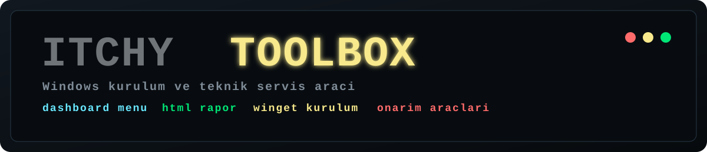
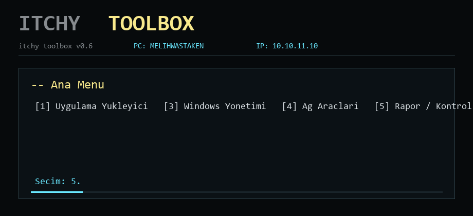
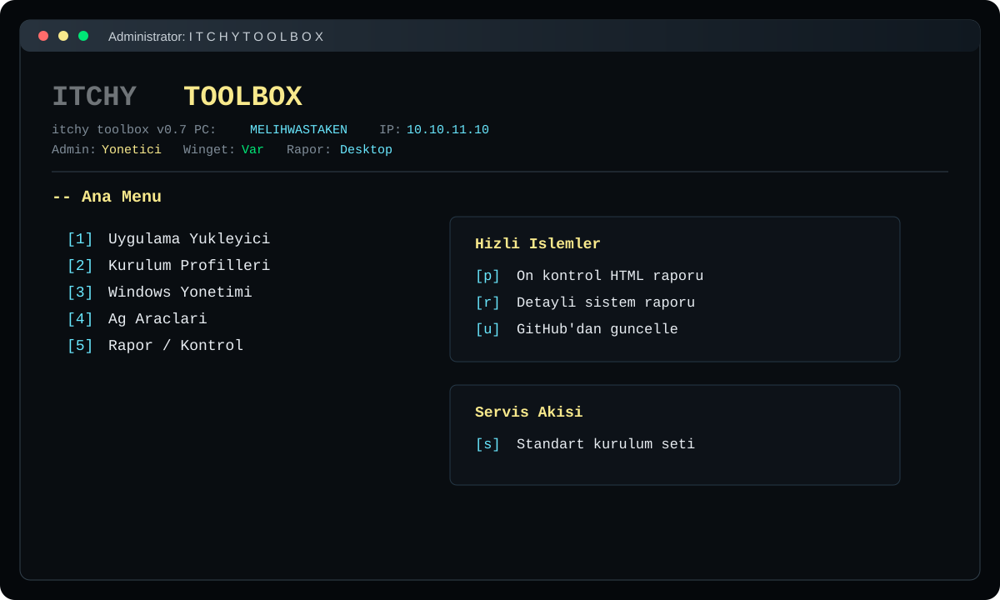
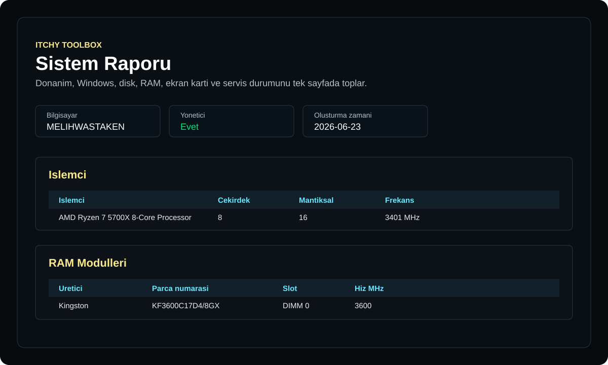
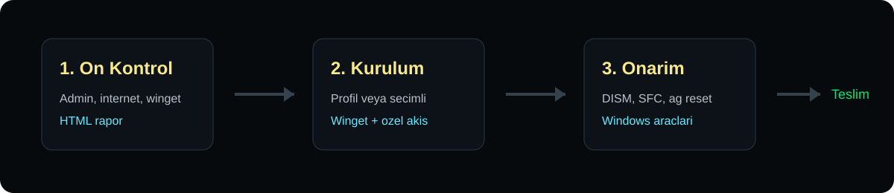

# Itchy Toolbox



<p align="center">
  <a href="https://github.com/Bogazitchy/Itchy-Toolbox/releases/latest"></a>
  
  
  
</p>

Itchy Toolbox, Windows kurulum ve teknik servis islemlerini tek bir CMD arayuzunde toplayan hafif bir sistem aracidir. Uygulama kurulumu, Windows onarim komutlari, hizmet ve ozellik yonetimi, ag kontrolleri, HTML raporlama, lisans islemleri ve kayitli WiFi bilgileri tek menuden yonetilir.

> Guncel surum: `0.6`

## Onizleme

### Kisa Demo



### Terminal Arayuzu



### HTML Rapor Temasi



### Teknik Servis Akisi



## Indirme

En guncel paket icin GitHub Releases bolumundeki `Itchy-Toolbox-v0.6.zip` dosyasini indirin.

[Latest Release](https://github.com/Bogazitchy/Itchy-Toolbox/releases/latest)

Release paketi icinde ana CMD dosyasi, PowerShell rapor scriptleri ve README birlikte gelir. Kaynak kod ZIP'i yerine release paketini kullanmak daha pratiktir.

## Neler Sunar?

| Bolum | Ne ise yarar? |
| --- | --- |
| Uygulama Yukleyici | Kategorili uygulama listesi, coklu secim, winget ve ozel kurulum akislarini yonetir. |
| Kurulum Profilleri | Standart cihaz, teknik servis, oyun-medya ve gelistirici setlerini tek secimle kurar. |
| Windows Yonetimi | Onarim, hizmetler, Windows ozellikleri, ayarlar, sistem araclari ve surucu kisayollarini toplar. |
| Ag Araclari | Ping, DNS, ag reset, IP bilgisi, WiFi sifreleri ve HTML ag raporu uretir. |
| Rapor / Kontrol | On kontrol, kurulum sonrasi kontrol, sistem raporu ve kurulum raporlarini hazirlar. |
| Bakim / Ayar / Guncelleme | Bakim profilleri, loglar, tema, splash ve GitHub self-update islemlerini yonetir. |

## Arayuz

- Pixel tarzinda `ITCHY TOOLBOX` acilis ve ust banner.
- Ana menude dashboard tipi hizli islem alani.
- Her ekranda `Admin`, `Winget` ve `Rapor klasoru` durum cubugu.
- Acilista admin, winget ve internet kontrolu.
- CMD uyumlu sade tablo cizgileri.
- `x` ile geri donuste mumkunse ilgili ust kategoriye donen daha rahat gezinme.
- HTML raporlarda koyu tema, tam genislik kartlar ve yatay kaydirma gerektirmeyen tablolar.

## Uygulama Yukleyici

Uygulama Yukleyici, sik kullanilan programlari kategori halinde listeler. Birden fazla programi virgulle secerek toplu kurulum yapabilirsiniz.

```text
9,40,46
```

Mevcut kategori gruplari:

| Kategori | Ornekler |
| --- | --- |
| Mesajlasma | Discord, WhatsApp, Telegram, Zoom |
| Oyun Kutuphanesi | Epic Games, Steam, Ubisoft Connect, EA App |
| Tarayici | Chrome, Edge, Opera, Firefox, Brave, Tor, Zen |
| Donanim | HWiNFO, HWMonitor, CPU-Z, GPU-Z, FurMark, BatteryInfo |
| Disk / USB | CrystalDiskInfo, CrystalDiskMark, WizTree, Everything, Rufus, Ventoy |
| Multimedya | CapCut, GIMP, OBS Studio, Lightshot, HandBrake |
| Belgeler | Adobe Acrobat Reader, PDF-XChange Editor, LibreOffice |
| Uzak Destek | AnyDesk, Alpemix, RustDesk |
| Guvenlik | Malwarebytes, AdwCleaner |
| Runtime / Gelistirme | VC++ Runtime, .NET Runtime, Node.js, Git, VS Code |
| Itchy Programlari | Itchy YouTube Downloader, Itchy Backup |

## Ozel Kurulum Destegi

Bazi uygulamalar `winget` manifest hatasi, hash uyusmazligi, Microsoft Store kaynak farki veya yonetici oturumu kisiti nedeniyle standart kurulumda sorun cikarabilir. Bu uygulamalar toolbox icinde ozel akisa alinmistir.

| Uygulama | Ozel akis |
| --- | --- |
| WhatsApp | Microsoft Store kaynak ID'si ile kurulur. |
| CrystalDiskInfo | Winget hash sorunu olursa resmi kaynaktan baslatilir. |
| Spotify | Yonetici oturumu kisitini asmak icin ozel kurulum denenir. |
| DMDE | Resmi siteden indirilip cikarilir. |
| RustDesk | GitHub son surum dosyasindan indirilir. |
| Malwarebytes | Winget 403 hatasi yerine resmi indirme adresi kullanilir. |
| IObit Unlocker | Winget hash sorunu yerine resmi indirme adresi kullanilir. |
| Java Uninstaller | Oracle Java Uninstall Tool indirilip baslatilir. |
| Itchy YouTube Downloader | [Bogazitchy/Itchy-YouTube-Downloader](https://github.com/Bogazitchy/Itchy-YouTube-Downloader) son release setup dosyasi kullanilir. |
| Itchy Backup | [Bogazitchy/Itchy-Backup](https://github.com/Bogazitchy/Itchy-Backup) son release setup dosyasi kullanilir. |

Ozel kurulumlu uygulamalar listede `*` ile isaretlenir.

## Raporlama

Itchy Toolbox teknik servis islemleri icin okunabilir HTML raporlar uretir.

| Rapor | Icerik |
| --- | --- |
| `Itchy-Precheck-Report.html` | Admin, internet, winget, lisans, RAM, disk ve reboot durumu. |
| `Itchy-Install-Report.html` | Kurulum denemeleri, basarili ve basarisiz uygulamalar. |
| `Itchy-System-Report.html` | Windows, anakart, BIOS, CPU, RAM, disk, GPU, servis ozeti ve guncellemeler. |
| `Itchy-Network-Report.html` | Bagdastiricilar, IP, DNS, rota, WiFi profil adlari ve baglanti testleri. |

Rapor tablolarinda yatay kaydirma gerektirmeyen, ekran goruntusu almaya daha uygun tam genislik tasarim kullanilir.

## Windows Onarim

Windows Onarim menusu sik kullanilan servis komutlarini guvenli bir yerde toplar.

- CHKDSK online disk tarama
- DISM ve SFC sistem dosyasi onarimi
- Disk Cleanup
- Event Viewer
- Task Manager
- Windows Memory Diagnostic
- Sistem geri yukleme noktasi olusturma
- Windows Update bilesenlerini sifirlama
- Ag onarim komutlari

## Ag Araclari

- Tanimli sitelerin ping ve DNS surelerini anlik gosterir.
- Girilen alan adi icin ping olcer.
- Girilen alan adi icin DNS sorgu suresini olcer.
- Cloudflare, AdGuard, Quad9, ControlD ve Google DNS sunucularini test eder.
- Aktif ag bagdastiricilarinda DNS degistirebilir.
- DNS ayarlarini otomatik moda alabilir.
- Kayitli WiFi bilgilerini gosterir.
- Detayli HTML ag raporu olusturur.

## Kurulum Profilleri

| Profil | Icerik |
| --- | --- |
| Standart cihaz | Adobe Reader, Chrome, AnyDesk, PotPlayer, WinRAR, Alpemix |
| Teknik servis | Standart set, 7-Zip, disk araclari, Everything, Rufus, Revo, Sysinternals |
| Oyun ve medya | Steam, EA App, OBS, codec, VLC, PotPlayer, Spotify, DirectX, VC++ Runtime |
| Gelistirici | Notepad++, VS Code, Git, Node.js, .NET Runtime, VC++ Runtime, Sysinternals |

## Gereksinimler

- Windows 10 veya Windows 11
- CMD ve PowerShell
- Uygulama kurulumlari icin Windows Package Manager (`winget`)
- Microsoft Store kaynakli paketler icin `msstore` winget kaynagi
- Bazi islemler icin yonetici izni

`winget` bulunmazsa Uygulama Yukleyici ekranda uyari verir. Bu durumda Microsoft App Installer / Windows Package Manager kurulumu kontrol edilmelidir.

## Kullanim

1. Release paketini indirin ve ZIP dosyasini cikarin.
2. `Itchy ToolBox.cmd` dosyasini calistirin.
3. Gerekirse ana menuden `Yonetici Olarak Yeniden Baslat` secenegini kullanin.
4. Ana menuden numara veya hizli islem harfi girin.
5. Alt menulerde `x` geri doner, `q` programdan cikar.

## Olusturulan Dosyalar

Program bazi seceneklerde masaustune veya ayarlanan rapor klasorune dosya olusturabilir.

| Dosya | Aciklama |
| --- | --- |
| `Itchy-Winget-Apps.json` | Winget uygulama disari aktarimi |
| `Itchy-Precheck-Report.html` | On kontrol raporu |
| `Itchy-Install-Report.html` | Kurulum raporu |
| `Itchy-System-Report.html` | Sistem raporu |
| `Itchy-Network-Report.html` | Ag raporu |
| `Itchy-Toolbox-Data\Logs\Itchy-Toolbox.log` | Toolbox log dosyasi |
| `Itchy-Toolbox-Data\last-install-log.csv` | Son kurulum kayitlari |

## Guvenli Kullanim Notlari

- Onarim ve reset komutlarini calistirmadan once kullanicinin islerini kaydettiginden emin olun.
- Ag reset islemlerinden sonra yeniden baslatma gerekebilir.
- Windows Update sifirlama islemi guncelleme onbellegini yeniden olusturur.
- Lisans menusu yalnizca gecerli Windows ve Office urun anahtarlari icin kullanilmalidir.
- Kayitli WiFi sifreleri sadece yetkili olunan cihazlarda goruntulenmelidir.

## Dosyalar

| Dosya | Gorev |
| --- | --- |
| `Itchy ToolBox.cmd` | Ana program |
| `Itchy.Reports.ps1` | Sistem ve ag HTML raporlari |
| `Itchy.Tools.ps1` | On kontrol, kurulum raporu ve self-update yardimcisi |
| `README.md` | Proje aciklamasi |
| `docs/assets/` | README logo ve onizleme gorselleri |

## Gelistirici

Created by: M.Mert
